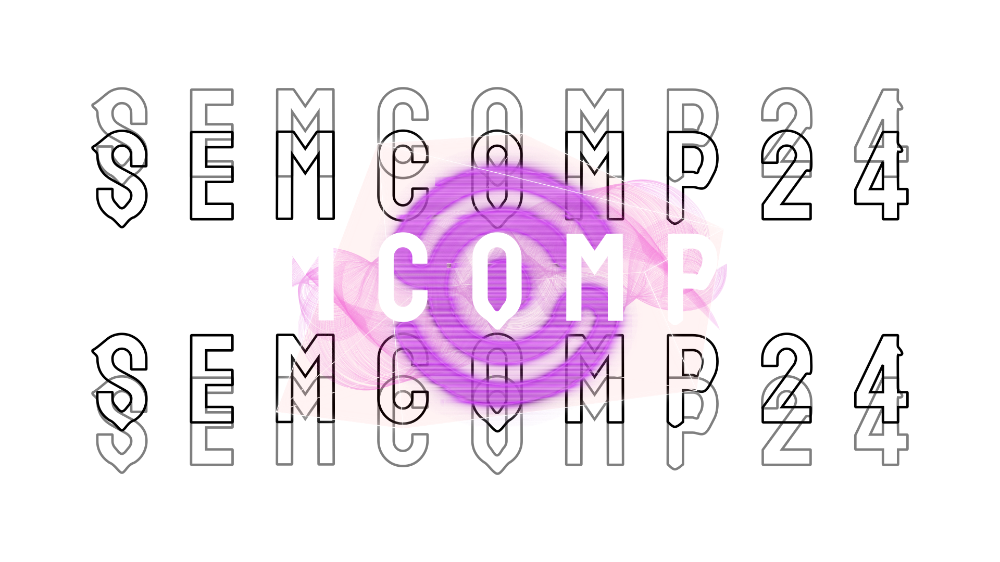

# Semcomp - workshoops, talks and all things Computer Science!

---

## Introduction

A Semcomp é a Semana Acadêmica de Computação dos cursos de Ciências de Computação e Sistemas de Informação do ICMC-USP. Ela é composta de palestras, minicursos, gamenight e muito mais!

